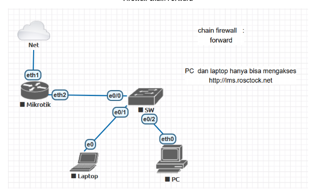
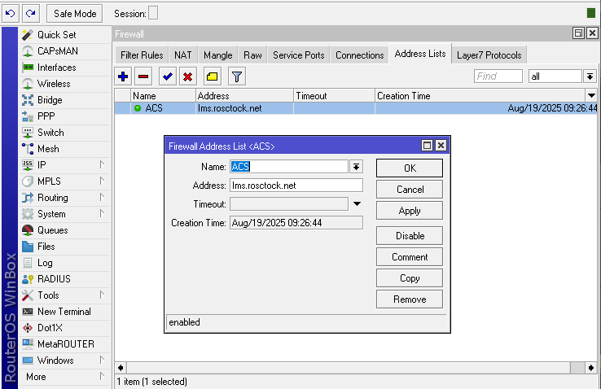
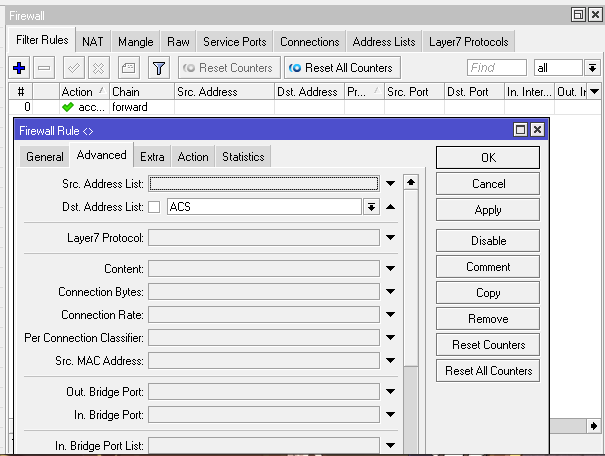

# LAB-23-Firewall-chain-Forward
tanggal 16 Agustus 

Dri gambar topologinya menunjukkan bahwa **PC dan Laptop hanya boleh mengakses situs [http://lms.rosctock.net](http://lms.rosctock.net)**. Semua akses lain ke internet akan diblokir menggunakan **chain forward** di Mikrotik.

---

# Langkah Konfigurasi Firewall Chain Forward di Mikrotik
1. Lakukan konfigurasi awal Mikrotik seperti membuat IP Static, DHCP Client, DHCP Server, dan NAT. Sampai Laptop terhubung dan bisa mengakses internet.

2. Setting DHCP static lease agar IP tidak berubah.

    /ip dhcp-server lease add address=192.168.10.104 mac-address=00:90:F5:C7:5C:5C

3. Tambahkan Address-List untuk situs yang diizinkan.
   IP > FIREWALL > ADDRESS-LIST.

   
4. Buat Rule untuk Mengizinkan Akses ke Situs Tersebut agar setiap trafik forward yang menuju ke alamat di daftar allow_site diizinkan.
   Firewall > Filter.

 
5. Buat agar firewall blokir semua akses internet lain.

   
**pengujian**

* Saat client mengakses `lms.rosctock.net` → berhasil terbuka.
* Saat client mencoba membuka situs lain → akses ditolak (request timeout).

# Kesimpulan

Dengan **chain forward**, kita dapat mengontrol lalu lintas yang melewati router.  
selain ke situs yang diizinkan akan diblokir, sehingga jaringan menjadi lebih aman dan penggunaan internet lebih terkontrol.
